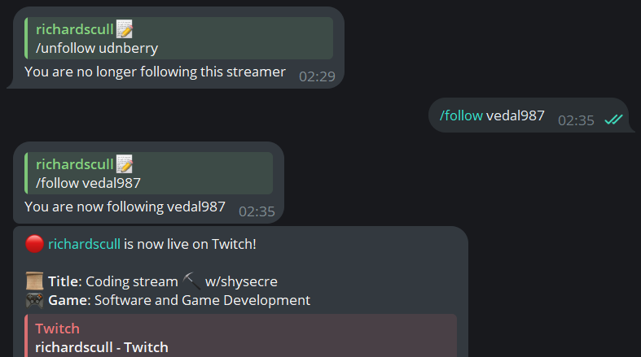

<h1 align="center">🔔 Twitch Notifier</h1>
<p align="center">

</p>

## Description

Twitch Notifier is a Telegram bot that notifies you when your favorite streamer goes live.

## Features

- Add streamers to your list using `/follow` command
- Use `/import` command to import your followed channels from Twitch
- Check your followed channels using `/list` command
- And if you want to change language, use `/language` command (currently available: English, Russian)

## Requirements

If you want to try app by yourself, you will need:

- Node.js v14.17.0 or higher

## Installation

1. Install any [Node.js](https://nodejs.org/en) version.
2. Install last release from [here](https://github.com/richardscull/TwitchNotifier/releases) (You can also just clone this repo)
3. Create `.env` in source folder and setup it like this:

```env
TELEGRAM_BOT_TOKEN= # Get it from @BotFather
# < - - - - - - - - - ->
TWITCH_CLIENT_ID= # Get it from https://dev.twitch.tv/console/apps
TWITCH_CLIENT_TOKEN= # Same as above
# < - - - - - - - - - ->
MONGO_URI= # Get it from https://www.mongodb.com/cloud/atlas or setup your own MongoDB server
HOST_URI= # Your host uri, example: https://example.com
PORT= # Your port, example: 3000
# < - - - - - - - - - ->
CRYPTO_KEY= # Your crypto key, example: verysecretkey
```

4. Run `Start.bat` (or `Start.sh` for Linux) and enjoy!

## Technologies

- Next.js
- TypeScript
- MongoDB

- Telegram Bot API
- Twitch API
